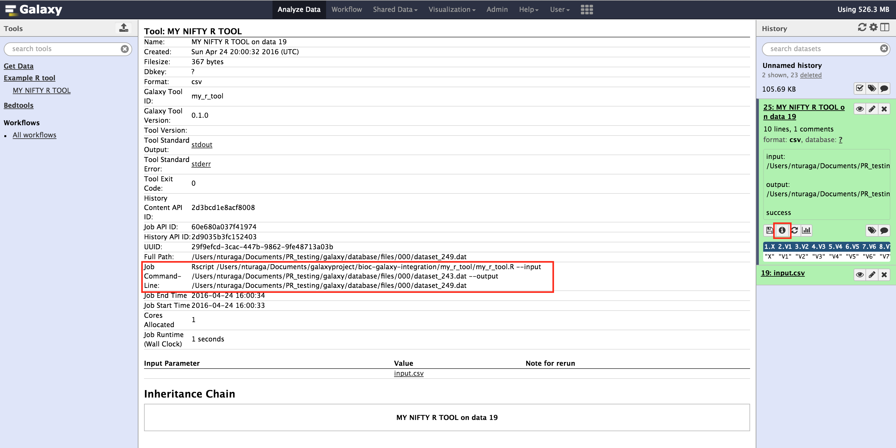
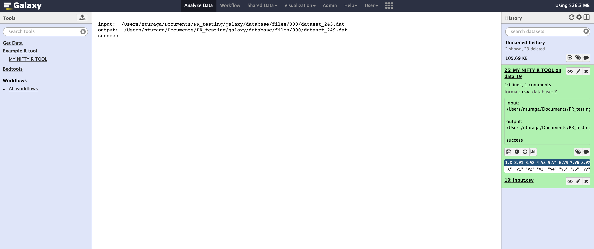

Writing Galaxy tool wrappers for R and Bioconductor packages
===================

This tutorial is going to cover how to wrap R / Bioconductor packages as Galaxy tools. **It is aimed at complete beginners at Galaxy and also people writing Galaxy tools for R or Bioconductor packages for the first time**. [Bioconductor](https://www.bioconductor.org/) represents a large body of Bioconductor tools which are highly used, are ready to be integrated into the Galaxy platform.

Aims to familiarize readers with: 

- R package integration to Galaxy
- Bioconductor package integration to Galaxy
- Best practices to handle R/Bioconductor tool integration

NOTE: Tools from different languages can be integrated with Galaxy. Galaxy is language agnostic, but, this document takes a very R centric approach to tool integration. 

----------

### Table of contents

1. [Lets talk about Galaxy tools first](#lets-talk-about-galaxy-tools-first)
2. [Galaxy Tool Components](#galaxy-tool-components)
	* [Input](#input)
	* [Output](#output)
	* [Wrapper](#wrapper)
3. [Types of Tools](#types-of-tools)
	* [Single Input with Single Output](#single-input-with-single-output)
	* [Single Input with Multiple Outputs](#single-input-with-multiple-outputs)
	* [Multiple Inputs with Single Output](#multiple-inputs-with-single-output)
	* [Multiple Inputs with Multiple Outputs](#multiple-inputs-with-multiple-outputs)
4. [R and Bioconductor tool integration best-practices](#r-and-bioconductor-tool-integration-best-practices)
	* [DESeq2 a model package for Galaxy written by Bjoern Gruening](#deseq2-a-model-package-for-galaxy-written-by-bjoern-gruening)
5. [Dataset collections for Bioconductor tools](#dataset-collections-for-bioconductor-tools)
6. [How to handle RData files](#how-to-handle-rdata-files)
7. [Putting your wrapper in configfile](#putting-your-wrapper-in-configfile)
8. [Publishing tools to IUC for Code review](#publishing-tools-to-IUC-for-code-review)
9. [R and Bioconductor tool wrapping tips](#r-and-bioconductor-tool-wrapping-tips)
    * [Leverage Planemo to build and test your tools](#leverage-planemo-to-build-and-test-your-tools)
    * [Test Test and Test some more](test-test-and-test-some-more)
    * [Interactive tours for your tool](interactive-tours-for-your-tool)
    * [Maintain it for future versions](maintain-it-for-future-versions)
10. [Join the Galaxy community](#join-the-galaxy-community)

------------


Lets talk about Galaxy tools first
-------------

A Galaxy tool defined by a Tool definition file (XML format) has three important components, 

1. **Inputs** - Single or Multiple Inputs 
2. **Outputs** - Single or Multiple Outputs
3. **Command** - The command which needs to be run by galaxy via the R interpreter

The tool definition file is also called a **Wrapper** sometimes. The other piece of this process of integrating a R/Bioconductor package is a

4. **Custom Script** - Script using the R or Bioconductor package of your choice.

Some excellent resources you can refer to for more information:
- [Official Galaxy Tool Wiki](https://wiki.galaxyproject.org/Admin/Tools/)
- [Add a tool tutorial Wiki](https://wiki.galaxyproject.org/Admin/Tools/AddToolTutorial)

---------------


Galaxy Tool Components
-----------------------

**Directory structure of your tool**

Your tool wrapper (tool definition file) and your script should go into their own directoy (eg: ```my_r_tool```). So the directory structure to your your ```my_r_tool``` would look like: 

```
my_r_tool/
├── my_r_tool.R # R script 
├── my_r_tool.xml # Tool definition file
├── test-data # Test data sets for your tool to work with Planemo
│   ├── input.csv 
│   └── output.csv
```

###Tool definition file

The tool definition file given below is going to be the minimal structure of your galaxy tool definition file. This tool definition file will go into your XML file: ```my_r_tool.xml```. 

```
<tool id="my_r_tool" name="MY NIFTY R TOOL" version="0.1.0">
    <command detect_errors="exit_code"><![CDATA[
        Rscript </full/path/>my_r_tool.R --input $galaxy_input --output $galaxy_output 
    ]]></command>
    <inputs>
        <param type="data" name="galaxy_input" format="csv" /> 
    </inputs>
    <outputs>
        <data name="galaxy_output" format="csv" />
    </outputs>
    <tests>
        <test>
            <param name="galaxy_input" value="input.csv"/>
            <output name="galaxy_output" file="output.csv"/>
        </test>
    </tests>
    <help><![CDATA[
        Write you tool help section here
    ]]></help>
    <citations>
        <!-- Sample citation to the original Galaxy paper -->
        <citation>10.1186/gb-2010-11-8-r86</citation>
    </citations> 
</tool>

```

This is going to be the minimal structure of your tool wrapper, calling some Bioconductor package or R package.The [Sample tool definition file](https://wiki.galaxyproject.org/Tools/SampleToolTemplate?action=show&redirect=Admin%2FTools%2FExampleXMLFile) gives you the structure of the tool definition file.

#### What is this CDATA?

In an XML document or external parsed entity, a CDATA section is a section of element content that is marked for the parser to interpret purely as textual data, not as markup. A CDATA section is merely an alternative syntax for expressing character data; there is no semantic difference between character data that manifests as a CDATA section and character data that manifests as in the usual syntax in which, for example, "<" and "&" would be represented by "&lt;" and "&amp;", respectively. So, using CDATA is good if you don't want to use the usual syntax. It is also a [best practice](https://galaxy-iuc-standards.readthedocs.org/en/latest/best_practices/tool_xml.html#command-tag).


#### Inputs

The inputs in your Galaxy tool definition file are given by the XML tags ```<inputs>``` and each input inside of it is given by ```<param>``` tag. In the ```<param>``` tag you can define ```name, value, type, label``` attributes. More details can be found on these XML tags at [this link](https://wiki.galaxyproject.org/Admin/Tools/ToolConfigSyntax#A.3Cinputs.3E_tag_set).

#### Outputs

The outputs in your Galaxy tool definition file are given by the XML tags ```<outputs>``` and each output inside it is given by the ```<data>``` tag. In the ```<data>``` tag you can define ```name,format,from_work_dir``` attributes. More details can be found on these XML tags which define outputs here at [this link](https://wiki.galaxyproject.org/Admin/Tools/ToolConfigSyntax#A.3Cdata.3E_tag_set)


#### Command 

The full path to your tool is set in the wrapper file, in the **my_r_tool** directory. For example: **/Users/nturaga/Documents/my_r_tool/my_r_tool.R** (this is a reference from my home directory).

### Custom R script

The comments on top of each line of code in R wrapper explain the significance. This script goes into your **my_r_tool.R**. This script is very simple, it sets the first column of an input csv file to zeros and saves the ouput as another csv file.

```{r}
# Setup R error handling to go to stderr
options(show.error.messages=F, error=function(){cat(geterrmessage(),file=stderr());q("no",1,F)})

# We need to not crash galaxy with an UTF8 error on German LC settings.
loc <- Sys.setlocale("LC_MESSAGES", "en_US.UTF-8")

# Import library
library("getopt")
options(stringAsfactors = FALSE, useFancyQuotes = FALSE)
# Take in trailing command line arguments
args <- commandArgs(trailingOnly = TRUE)

# get options, using the spec as defined by the enclosed list.
# we read the options from the default: commandArgs(TRUE).
option_specification = matrix(c(
  'input', 'i', 2, 'character',
  'output', 'o', 2, 'character'
), byrow=TRUE, ncol=4);

# Parse options
options = getopt(option_specification);

# Print options to see what is going on
cat("\n input: ",options$input)
cat("\n output: ",options$output)


# READ in your input file
inp = read.csv(file=options$input, stringsAsFactors = FALSE)

# Do something with you input
# This one changes every value in the first column to 0
inp$V1 = c(rep(0,10))

# Save your output as the file you want to Galaxy to recognize.
write.csv(inp, file=options$output,row.names = FALSE)
cat("\n success \n")
```


### How does it all work together?

Lets start with Galaxy, first upload the file you would like to use as input to your tool(eg: MY NIFTY R TOOL) to your galaxy (eg: ```input.csv```). As you execute the tool,```input.csv``` is passed via your tool definition file template into your R script (```my_r_tool.R```). The script takes in command line arguments ```--input``` and ```--output```, and  the uploaded file ```input.csv``` is passed into your tool via the argument ```--input``` and the processed by it (```options$input``` is your ```input.csv``` file now). The value for ```--output``` is passed in by Galaxy, as the resulting dataset produced.

Its important not to worry about the working directory while writing your R script, because by default its going to be in the job working directory in Galaxy. So, ```setwd()``` and ```getwd()``` should not be needed. The 

You should write your R script in such a way that, it is testable and usable outside of Galaxy. This allows your script to be easily accessible to users both within the Galaxy world and outside. You can test this R script with the command line instruction 

```
Rscript my_r_tool.R --input 'input.csv'  --output 'output.csv'
```
 
If we look at the script run by the Galaxy tool, it looks very similar. This can be found if you click on the information *i* icon on your job run. 
 


```
Job Command-Line:	Rscript /Users/nturaga/Documents/my_r_tool/my_r_tool.R
--input /Users/nturaga/Documents/galaxy/database/files/000/dataset_243.dat 
--output /Users/nturaga/Documents/galaxy/database/files/000/dataset_249.dat
```

The print statments which you put into your R script go to your standard output (stdout), and are shown in the image below. You need to make sure none of your logs go into the stderr, because this will be interpreted as a tool error in Galaxy.




#### Make Galaxy aware of your tool

If not using [Planemo](https://planemo.readthedocs.org/en/latest/) and [ToolShed](https://wiki.galaxyproject.org/ToolShed), once you are done with your wrapper locally, you *NEED* to tell Galaxy you have a new tool by doing this:

1. Copy your own tool configuration file from the sample: 
 ```cp $GALAXY_ROOT/config/tool_conf.xml.sample $GALAXY_ROOT/config/tool_conf.xml```

2. Modify it by adding your own section and your wrapper inside like this: 
    ```
    <section name="Example R tool" id="rTools">
         <tool file="/Users/Documents/my_r_tool/my_r_tool.xml" />
    </section>
    ```
    More details [here](https://wiki.galaxyproject.org/Admin/Tools/AddToolTutorial#A4._Make_Galaxy_aware_of_the_new_tool:)
    
3. Restart your Galaxy

-------------


Types of Tools
----------------

Based on the nature of how the inputs and outputs are designed. A galaxy tool can have multiple inputs and multiple outputs. This gives the option for a Galaxy tool to have the following **types of tools**,

1. Single input with Single Output
2. Single input with Multiple Outputs
3. Multiple inputs with Single Output
4. Multiple inputs with Multiple Outputs.


#### Single Input with Single Output
- Single input with Single Output [INSERT Tool Example][1]

#### Single Input with Multiple Outputs
- Single input with Multiple Outputs [INSERT Tool Example][2]

#### Multiple Inputs with Single Output
- Multiple inputs with Single Output [INSERT Tool Example][3]

#### Multiple Inputs with Multiple Outputs
- Multiple inputs with Multiple Outputs [INSERT Tool Example][4]

----------


Handling dependencies for Bioconductor packages 
---------------

Dependency resolution for R/Bioconductor tools in Galaxy is made easy by a [script](https://github.com/bioarchive/aRchive_source_code/blob/master/get_galaxy_tool_dependencies.py)script developed and available through the bioarchive github repository. For now, the script is still needing a little refinement. The updates can be found in branch [bioarchive/get_tool_deps_fox](https://github.com/bioarchive/aRchive_source_code/tree/get_tool_deps_fix).

The dependencies need to go into a file called ```tool_dependencies.xml```, and Galaxy will set up an R environment with the dependencies referenced in this file. The exact versions of each of these packages is rerquired.

Sample directory structure for each package: 

```
package_BioconductorTool_1_0/
└── tool_dependencies.xml 
└── .shed.yml
```

Example package shown here is [CRISPRSeek version 1.11.0](https://github.com/galaxyproject/tools-iuc/tree/3c4a2b13b0f3a280de4f98f4f5e0dc29e10fc7a0/packages/package_r_crisprseek_1_11_0): 

1. [tool_dependencies.xml file for package CRISPRSeek](https://github.com/galaxyproject/tools-iuc/blob/3c4a2b13b0f3a280de4f98f4f5e0dc29e10fc7a0/packages/package_r_crisprseek_1_11_0/tool_dependencies.xml)

2. [.shed.yml file for CRISPRSeek](https://github.com/galaxyproject/tools-iuc/blob/3c4a2b13b0f3a280de4f98f4f5e0dc29e10fc7a0/packages/package_r_crisprseek_1_11_0/.shed.yml)


There are other solutions being actively developed by Galaxy for tool dependency resolution:

1. [Conda](http://conda.pydata.org/docs/get-started.html)

2. [Bioconda channel](https://bioconda.github.io/)

3. [bioarchive.galaxyproject.org](https://bioarchive.galaxyproject.org/)


--------------


R and Bioconductor tool integration best practices
-------------------

#### DESeq2 a model package for Galaxy written by Björn Gruening

The DESeq2 script which can be used with Galaxy is now shipped along with the Bioconductor package directly. This script can be found here at this [link](https://github.com/Bioconductor-mirror/DESeq2/blob/release-3.2/inst/script/deseq2.R). This could be an valuable example for new Bioconductor tool authors who want to make their tool more easily available to the community. 

The way factors are represented in the script works well with the Galaxy framework. The way the factors are represented in the Galaxy tool form is also extremely functional, and allows users to choose multiple factors that effect the experiment pretty easily. There are many Bioconductor tools which work with a differential comparison model controlling for multiple factors, which could use this sort of tool form. The tool form for DESeq2 can be found here at this [link](https://github.com/galaxyproject/tools-iuc/blob/master/tools/deseq2/deseq2.xml). 


#### List of some best practices

The R script which is written for a Galaxy tool has a minimal set of requirements. These are non exhaustive and are listed below:

1. It needs to take in command line arguments for inputs. 

In the example script given (```my_r_tool.R```), we use the R package ```getopt``` to add command line arguments with flags. This can also be done in other ways using ```args = commandArgs(trailingOnly=TRUE)``` and then running your script with ```Rscript --vanilla randomScript.R input.csv output.csv``` which doesn't give you the option of defining flags, or using the package ```optparse``` for a more pythonic style. Refer this blog, if you want more details on [how to pass command line arguemnts in R](http://www.r-bloggers.com/passing-arguments-to-an-r-script-from-command-lines). We generally prefer options being passed through flags.

2.  A couple of extra lines which can be added to your script at the top are to setup R error handling to go stderr on Galaxy, and to handle a UTF8 error.

```
# Setup R error handling to go to stderr
options(show.error.messages=F, error=function(){cat(geterrmessage(),file=stderr());q("no",1,F)})

# We need to not crash galaxy with an UTF8 error on German LC settings.
loc <- Sys.setlocale("LC_MESSAGES", "en_US.UTF-8")
```

3. The ```cat``` (or ```print```) statements in the R script given as example are only to show how inputs and outputs are passed. These statements will into your stdout. 

4. The outputs in your script should be saved in a format which is present in the list of galaxy recognized datatypes - [List of galaxy datatypes](https://wiki.galaxyproject.org/Learn/Datatypes). Galaxy now also saves files as Rdata files, and the feature to visualize them is under development. Once the output is generated by your script, Galaxy recognizes it and then displays it as your job output.

5. Another good measure to avoid flooding the stdout() in your Galaxy is  to supressMessages within your R script while loading bioconductor packages is 

```
# Load required libraries without seeing messages
suppressPackageStartupMessages({
    library("minfi")
    library("FlowSorted.Blood.450k")
})
```

6. You can also set toggle verbose outputs via your R script and getopt package, this allows for easier debugging within your R script. You can also set intermittent status messages while your script is processing large datasets. This makes your R script usable outside of Galaxy as well. The script inside the file ```my_r_tool_again.R``` has a list of options which are better defined.

```
## Call this via "Rscript my_r_tool_again.R --verbose TRUE" from your command line
option_specifications <- matrix(c(
  "verbose", "v", 2, "logical"),
  byrow=TRUE, ncol=4)
options <- getopt(option_specifications)

# Toggle verbose option 
if (options$verbose) {
  cat("Print something useful to show how my script is running in Galaxy stdout \n")
}
```

7. Feature soon to be available : Conda dependency resolution for R/Bioconductor pacakges integrated in Galaxy.

----------


Dataset collections for Bioconductor tools
----------

Dataset collections written by the amazing [John Chilton](https://github.com/jmchilton) give Galaxy the ability to represent complex datasets and also run tools, on a collection of samples. Dataset collections are specially useful for tools which run on multiple files at the same time, the input would then comprise of a "collection of files".

Some examples for tools based on dataset collections are:

1. Minfi
2. Sickle

---------------


How to handle RData files
-------------


---------------
Putting your wrapper in configfile
--------------------

There is another way to write wrappers without putting your script in a separate file. It can be integrated into your XML through the ```<configfile>``` tag. This way, the developer can avoid having a separate file for his Rscript. There are pros and cons to this method

Pros

1. Single file

2. 


Publishing tools to IUC for Code review (Recommended)
-------------
Once you are happy with your tools, you can publish it on Galaxy in many ways. List them all here:


-------------------


R and Bioconductor tool wrapping tips
--------------------

#### Exit codes for R tools

#### How to handle inputs and outputs through getopt package

#### How to avoid the x11 trap      

#### Leverage Planemo to build and test your tools

#### Test Test and Test some more

#### R session running on your galaxy

You local machine is going to have you R_HOME set to your default R installation. But you want to invoke the R installation with the galaxy tool dependency directory. The **tool-dependency** directory is set via your galaxy.ini file. 

```
tool_dependency_dir = /Users/nturaga/Documents/workspace/minfi_galaxy/shed_tools
```

#### Interactive tours for your tool

#### Maintain it for future versions

#### Use the python package Rpy2 for your tool wrappers


--------


Some tools in Bioconductor which are available through Galaxy
--------------
  
1. [cummerbund](https://github.com/galaxyproject/tools-devteam/tree/master/tools/cummerbund)
2. [DESeq2](https://github.com/galaxyproject/tools-iuc/tree/master/tools/deseq2)
3. [DEXseq](https://github.com/galaxyproject/tools-iuc/tree/master/tools/dexseq)
4. [minfi]()

--------

[Join the Galaxy Community](https://wiki.galaxyproject.org/GetInvolved)
--------------

1. [https://github.com/galaxyproject](https://github.com/galaxyproject)
2. [https://usegalaxy.org](https://usegalaxy.org)
3. [https://galaxyproject.org](https://galaxyproject.org)
4. [https://github.com/galaxyproject/tools-iuc](https://github.com/galaxyproject/tools-iuc)
5. [https://github.com/galaxyproject/tools-devteam](https://github.com/galaxyproject/tools-devteam)
6. [Galaxyproject on IRC (server: irc.freenode.net)](https://wiki.galaxyproject.org/GetInvolved#IRC_Channel)
7. [https://wiki.galaxyproject.org/Admin/Tools/AddToolTutorial](https://wiki.galaxyproject.org/Admin/Tools/AddToolTutorial)

[](https://github.com/galaxyproject)

**NOTE** These tool design models will be constantly improving, if you see any changes that need to be made, please send me a pull request with the material or file an issue. Help from the community to improve this document is always welcome.
